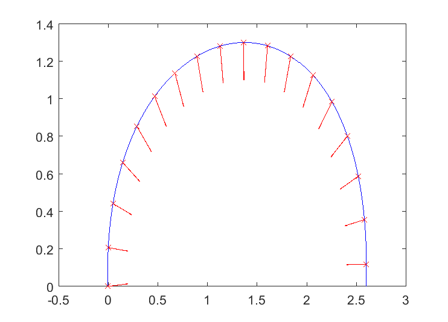
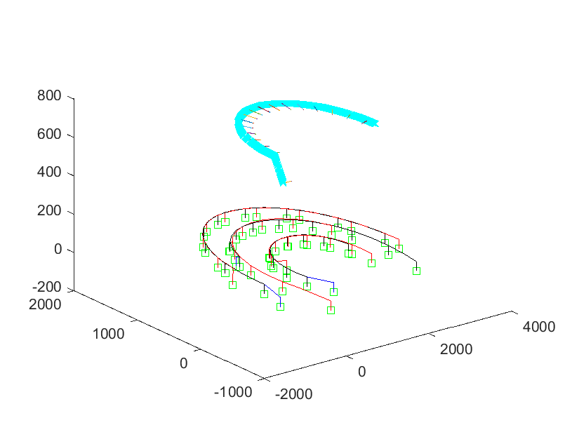

# Blind Walking SLAM Algorithm

## Motivation 
Walking robots represent a very good solution from the perspective of mobility but require of
more elegant (and complex) controllers capable of dealing with terrain uncertainty. This thesis
thence was realised under supervision of Ecole Centrale de Nantes (France), Shanghai Jiao Tong University (China) and Universita degli Studi di Genova (Italy), contributing to the research field
of mobile robots by generating a perception through interaction scheme allowing a parallel hexapod robot intended for
welding purposes on nuclear pressure vesssels with an average maximum step length of 0.25 m
to walk on even terrain and a further extension of its capabilities into a second version capable
of negotiating uneven terrain.

The robot does not have any kind of visual system attached, for which the environment has to be mapped from the robot joints (encoders) generating what is called as a blind walking SLAM algorithm, as localization is estimated simultaneously. Because of the well organized structure of the system, the scheme accomplishes with many
requirements contemporaneously and stands out for its predictiveness, adaptiveness, modularity,
parametrized nature, proof of convergence, static stability maximisation for the given terrain,
fast computation predictive scheme and robot task compliance. A test robot SJTU’s Octopus
is considered, the geometric and kinematic models of the robot are given according to previous
stages of research and the general robot kinematic model is deducted. These models are used
as part of a gait generation chain computing the geometric quantities of the gait, feasibility and
boundedness checks.

## 摘要
从移动性能角度来看,步行机器人是一个很好的解决方案,但是需要更加复杂的控制器以具
备适应地形的不确定性。本论文致力于移动机器人研究,在ECN,SJTU和UG的共同指导下完
成。论文中提出一种控制策略使得用于核电站压力容器焊接的并联六足机器人可以在平地上行
走,其最大步长为0.25m,并且进一步扩展其性能使得该机器人能在不平的地面上行走。

最后,基于确定的系统性能需求提出了可能的系统扩展方向。提出了稳定性问题的逆向解
(即,对于某一允许的最小稳定裕度,机器人能够适应更大的不平整度),并在此基础上给出
了通过外部传感器反馈信号及在线调整参数修正机器人行为的可能性。

## Code

The code is separated in several folders, each accomplishing an important part of the estimation scheme. 
- Functional Polygons: Low level functions dealing with 2D polygon sectioning and several capabilities like centroid and area calculation.
- Slice Trajectory: A given polynomial trajectory can be sliced inindependent slices using at least a stride parameter to allow for the general setpoints of movement of the robot to be computed.

- Polygons on path: Functions used to decide how to set the polygons alot the pat, the corners of which belong to the grounded feet of the robot.

- Gait geometric planning: General planning of the movement in which the movement among contiguos polygons is separated in several differenciated phases to be followed by the robot.
- Feasibility geometric plan: Helps to cheack for the feasibility of the plan until this step of computation.
- Gait kinematic planning: Allows for the computation of velocities needed to control the feet in a certain manner.
- Kinematic feasibility: Speed checks are performed to allow overloading the effectors.
- Open Loop Gait Planning Example: An example of the plan for even terrain.

## Installation
Given that the code is written in Matlab, this is the only requirement needed. The real time code was generated through a Simulink scheme .
